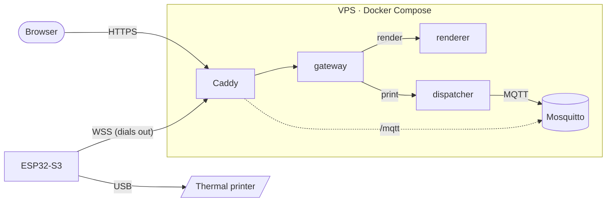

<div align="center">

# 📠 fax

**A receipt printer in my flat that anyone on the internet can print to.**

[](https://fax.pielka.sh)

[](https://github.com/michal-pielka/fax/actions/workflows/images.yml)
[](https://github.com/michal-pielka/fax/actions/workflows/firmware.yml)


<!-- TODO: hero video of a receipt coming out of the printer -->


<sub><i>Real paper, printed from my browser.</i></sub>

</div>

<br>

> [!TIP]
> **Go print me something at [fax.pielka.sh](https://fax.pielka.sh).**
> A hello, a beer invitation, a selfie. It comes out in my flat a few seconds later,
> and I read every one. 🧾

## What it is

You write on a receipt in your browser, swipe it off the top of the screen,
and a thermal printer in my flat prints it. There's no app and no account.

| | |
| --- | --- |
| **Paper** | 9 lines × 32 characters |
| **Styles** | bold, underline, white-on-black |
| **Photos** | dithered to 1-bit in your browser, 384 dots wide |
| **Feedback** | the site says "printed" only once the printer has taken the job |

## How it works



A print request waits the whole way through: the browser gets its answer only
after the printer has acked the job.

<details>
<summary><b>The pieces, in order</b></summary>
<br>

1. **Browser** (`frontend/`): vanilla JS with no build step. It lays text out
   on the paper grid, dithers photos, and posts to `POST /api/print`.
2. **Caddy**: the only service facing the internet. It terminates HTTPS and
   routes the site, the API and the MQTT websocket.
3. **gateway** (`backend/`): the public API. It checks the message fits the
   paper, then calls the renderer and the dispatcher.
4. **renderer**: turns text or a photo into the printer's own command bytes
   (ESC/POS).
5. **dispatcher**: publishes the job over MQTT and waits for the printer to
   answer.
6. **Mosquitto**: the message broker. The printer's account can receive jobs
   but never create them.
7. **ESP32-S3** (`firmware/`, Rust): sits next to the printer and dials out
   over a secure websocket, so nothing at home is exposed. It checks for
   paper, writes the bytes over USB, and acks back.

</details>

<!-- TODO: photo of the hardware (ESP32-S3 + printer) -->

## Repository

```
frontend/   the receipt you type on (HTML, CSS, ES modules)
backend/    gateway, renderer and dispatcher (Go)
firmware/   ESP32-S3 firmware, USB host for the printer (Rust, ESP-IDF)
deploy/     Caddy, Mosquitto, deploy and log scripts
```

<details>
<summary><b>Run your own</b></summary>
<br>

**Server** (Docker with Compose):

```sh
cp .env.example .env    # set MQTT_PASSWORD
# create the broker users `backend` and `printer`; see deploy/README.md
docker compose up -d --build
```

**Board** (needs the [esp-rs](https://github.com/esp-rs) toolchain):

```sh
cd firmware
WIFI_SSID=... WIFI_PASS=... MQTT_PASS=... cargo run --release
```

**Tests:**

```sh
cd backend  && go test ./...
cd frontend && npm test
```

The full deploy guide is in [`deploy/README.md`](deploy/README.md).

</details>

---

<div align="center">

### [fax.pielka.sh](https://fax.pielka.sh)

*The paper is waiting.*

<sub>Receipt font: <a href="https://fonts.google.com/specimen/VT323"><i>VT323</i></a> by Peter Hull, under the SIL Open Font License.</sub>

</div>
